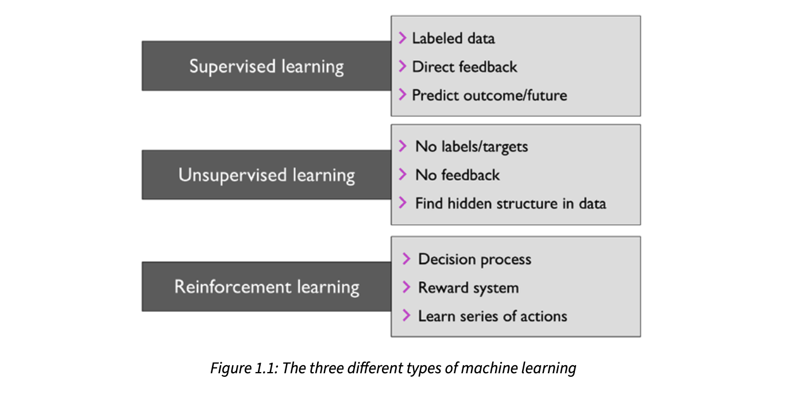
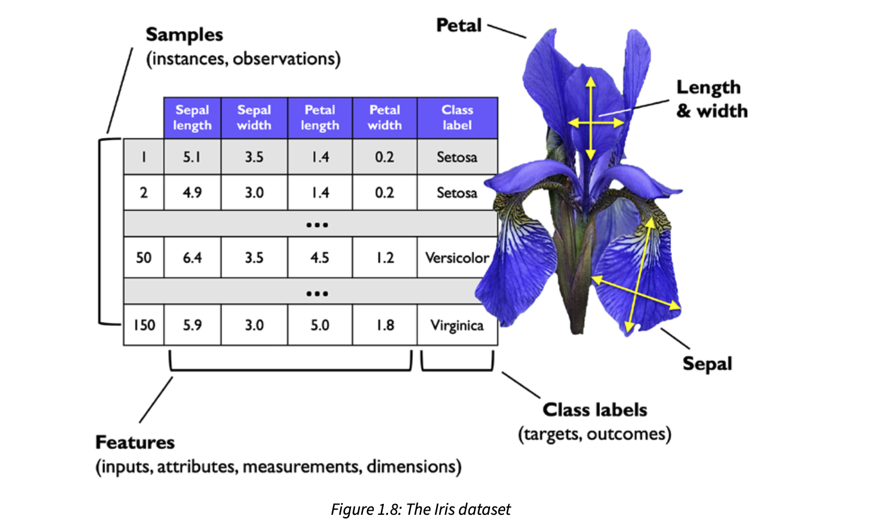
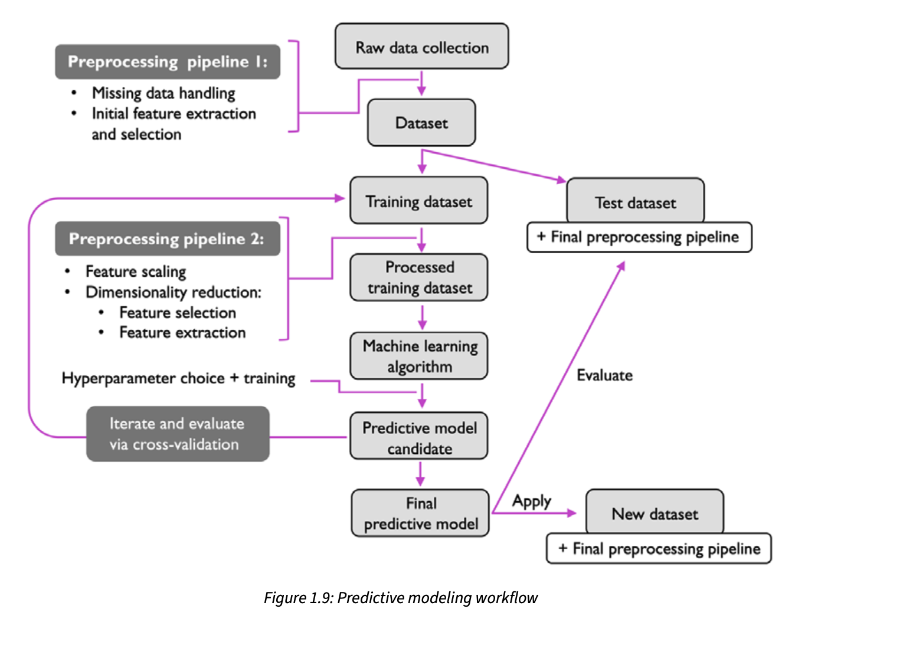

## Making predictions about the future with supervised learning

The main goal in supervised learning is to learn a model from labeled training data that allows us to
make predictions about unseen or future data. Here, the term “supervised” refers to a set of training
examples (data inputs) where the desired output signals (labels) are already known. Supervised learn-
ing is then the process of modeling the relationship between the data inputs and the labels. Thus, we
can also think of supervised learning as “label learning.”

Considering the example of email spam filtering, we can train a model using a supervised machine
learning algorithm on a corpus of labeled emails, which are correctly marked as spam or non-spam,
to predict whether a new email belongs to either of the two categories. A supervised learning task
with discrete class labels, such as in the previous email spam filtering example, is also called a clas-
sification task. Another subcategory of supervised learning is regression, where the outcome signal
is a continuous value.

## Classification for predicting class labels

Classification is a subcategory of supervised learning where the goal is to predict the categorical class
labels of new instances or data points based on past observations. Those class labels are discrete, un-
ordered values that can be understood as the group memberships of the data points. The previously
mentioned example of email spam detection represents a typical example of a binary classification
task, where the machine learning algorithm learns a set of rules to distinguish between two possible
classes: spam and non-spam emails.

A typical example of a multiclass classification task is handwritten character recognition. We can
collect a training dataset that consists of multiple handwritten examples of each letter in the alphabet.
The letters (“A,” “B,” “C,” and so on) will represent the different unordered categories or class labels
that we want to predict. Now, if a user provides a new handwritten character via an input device, our
predictive model will be able to predict the correct letter in the alphabet with certain accuracy. How-
ever, our machine learning system will be unable to correctly recognize any of the digits between 0
and 9, for example, if they were not part of the training dataset.

## Regression for predicting continuous outcomes

We learned in the previous section that the task of classification is to assign categorical, unordered
labels to instances. A second type of supervised learning is the prediction of continuous outcomes,
which is also called regression analysis. In regression analysis, we are given a number of predictor
(explanatory) variables and a continuous response variable (outcome), and we try to find a relationship
between those variables that allows us to predict an outcome.

## Solving interactive problems with reinforcement learning

Another type of machine learning is reinforcement learning. In reinforcement learning, the goal is to
develop a system (agent) that improves its performance based on interactions with the environment.
Since the information about the current state of the environment typically also includes a so-called
reward signal, we can think of reinforcement learning as a field related to supervised learning. How-
ever, in reinforcement learning, this feedback is not the correct ground truth label or value, but a
measure of how well the action was measured by a reward function. Through its interaction with the
environment, an agent can then use reinforcement learning to learn a series of actions that maximizes
this reward via an exploratory trial-and-error approach or deliberative planning.

## Discovering hidden structures with unsupervised learning

In supervised learning, we know the right answer (the label or target variable) beforehand when we
train a model, and in reinforcement learning, we define a measure of reward for particular actions
carried out by the agent. In unsupervised learning, however, we are dealing with unlabeled data or
data of an unknown structure. Using unsupervised learning techniques, we are able to explore the
structure of our data to extract meaningful information without the guidance of a known outcome
variable or reward function.

## Finding subgroups with clustering

Clustering is an exploratory data analysis or pattern discovery technique that allows us to organize a
pile of information into meaningful subgroups (clusters) without having any prior knowledge of their
group memberships. Each cluster that arises during the analysis defines a group of objects that share a
certain degree of similarity but are more dissimilar to objects in other clusters, which is why clustering
is also sometimes called unsupervised classification. Clustering is a great technique for structuring
information and deriving meaningful relationships from data. For example, it allows marketers to
discover customer groups based on their interests, in order to develop distinct marketing programs.

## Dimensionality reduction for data compression

Another subfield of unsupervised learning is dimensionality reduction. Often, we are working with
data of high dimensionality—each observation comes with a high number of measurements—that
can present a challenge for limited storage space and the computational performance of machine
learning algorithms. Unsupervised dimensionality reduction is a commonly used approach in feature
preprocessing to remove noise from data, which can degrade the predictive performance of certain
algorithms. Dimensionality reduction compresses the data onto a smaller dimensional subspace while
retaining most of the relevant information.

## Introduction to the basic terminology and notations

Now that we have discussed the three broad categories of machine learning—supervised, unsuper-
vised, and reinforcement learning—let’s have a look at the basic terminology that we will be using
throughout this book. The following subsection covers the common terms we will be using when
referring to different aspects of a dataset, as well as the mathematical notation to communicate more
precisely and efficiently.

## A roadmap for building machine learning systems

- Preprocessing – getting data into shape
- Training and selecting a predictive model
- Evaluating models and predicting unseen data instances

